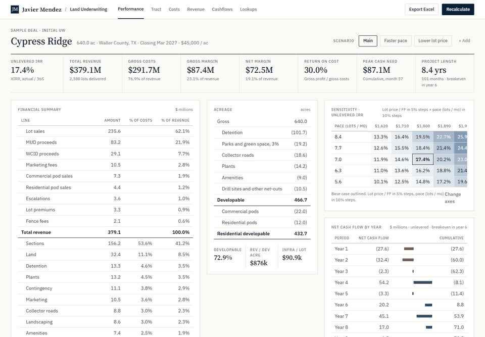

# Javier Mendez: transaction tools

I build transaction tools that improve decision making. This repo has two of them, developed with Claude Code and rebuilt on synthetic deals so anyone can read the full model.

Live site: https://javiermendez.up.railway.app



## What is here

**Land Underwriting.** A Python port of the master-planned-community land model I use at work: 640 acres, 21 cost lines, a 360-month ledger, unlevered XIRR. On the sample deal it matches the source engine to the dollar on every line and every month, and the XIRR to ten decimals, across three scenarios. You can edit every input in the browser, save scenarios, move the sensitivity grid across six drivers, and export the model to Excel with live formulas.

**Multifamily Copilot.** Upload a broker package (OM, rent roll, T-12). The tool pulls out the model inputs it can find, each with a page, a quote and a confidence grade, then asks about what the documents leave open: the bid, the renovation scope, the loan terms, the tax reassessment. Answers flow into a monthly acquisition model with loan sizing, a stress table and an LP/GP waterfall. Then it drafts the IC memo.

**Where the AI sits.** The model reads documents and writes sentences. It never does the math. Every extraction is checked against the page it cites. The memo writer works with placeholders and cannot write a digit; the code fills in every number from the model output. Both paths have eval sets and a written list of the ways they fail.

## Check it in five minutes

1. Open [Land Underwriting](https://javiermendez.up.railway.app/underwriting). Change the lot price on the Revenue tab and watch the strip, the cash flow and the grid update. Export and open the Summary sheet: the XIRR is a formula over the months, rather than a pasted value.
2. Open [Screen](https://javiermendez.up.railway.app/copilot/screen) and click "Use the sample documents". Fifteen figures come back with sources. Set insurance to the broker quote, click "Run the underwriting", and a Screened case shows up next to Base, Downside and Lender.
3. On the underwrite screen, read the stress table and the memo. Click "Draft IC memo" to have it rewritten. Download it as markdown.
4. Skim [docs/decisions.md](docs/decisions.md). Every trade-off is in there with the date and what I turned down, including a full port of the multifamily workbook that I decided was not worth it.
5. Run it yourself:

```bash
pip install -r requirements.txt -r requirements-dev.txt
pytest -q
python -m evals.screen.run
python -m evals.memo.run
```

## How it is put together

```
app/              FastAPI routes, Jinja templates, one stylesheet; sessions in memory per browser
core/underwriting Land model: netouts, land, infrastructure, allocation, sections, revenue,
                  assessed value and bonds, opex, summary, XIRR, sensitivity, Excel export
core/copilot      Multifamily model: rent roll, renovation, operations, debt, capital stack,
                  waterfall, sensitivity, Excel export; document readers, extraction, memo
evals/            Extraction eval (15 cited figures) and memo eval (fidelity, structure, copy rules)
data/             Synthetic seeds: Cypress Ridge (land), Sawyer Bend (multifamily) and its broker package
scripts/          Seed generators, the synthetic document generator, the copy linter
tests/            125 tests; fixtures freeze both engines' outputs
docs/             Decisions log, case study, failure modes, design standard, deals, cheat sheet
```

Routes call into `core/`; no model logic in a template. Percentages are fractions inside the models and percentages on screen. Edits live in a cookie-keyed session for a day, and a redeploy resets the demo, which is what I want on a public site.

Every push runs ruff, mypy in strict mode, pytest, and a copy linter that fails on em dashes and filler words, on templates, docs and generated memos alike.

## What is real

Nothing here is a real deal. Cypress Ridge, Sawyer Bend, the broker, the comps and the documents are made up so the tools can be shown in full. Market inputs come from public sources. No client data or internal files are in this repo. The internal models these descend from stay private; the decisions log says where the port reconciles to them and where it does not.

The AI paths (reading the OM, drafting the memo) run when `ANTHROPIC_API_KEY` is set. Without it a rule reader and a sentence template take over and the pages say so.

## Docs

- [Decisions](docs/decisions.md): every trade-off, dated, with what was rejected.
- [Case study](docs/case-study.md): what changed when the models left Excel, and what the tests caught.
- [Cheat sheet](docs/cheat-sheet.md): how the site works, how to run it, how to change the deals.
- [Screen failure modes](docs/screen-failure-modes.md) and [memo failure modes](docs/memo-failure-modes.md).
- [Synthetic deals](docs/synthetic-deals.md), [design standard](docs/design-standard.md), [brand mark](docs/brand-mark.md).

## About me

Finance and Analytics Manager at EMBER and MBA candidate at Rice. Six years in financial modeling, transaction analysis and FP&A across real estate investment and private equity, Houston and Chicago. I support acquisitions from underwriting through closing and post-close monitoring, and I build the software that does it. [LinkedIn](https://linkedin.com/in/javieremendez) · [GitHub](https://github.com/JavierEMendez) · [Full bio](https://javiermendez.up.railway.app/about)
